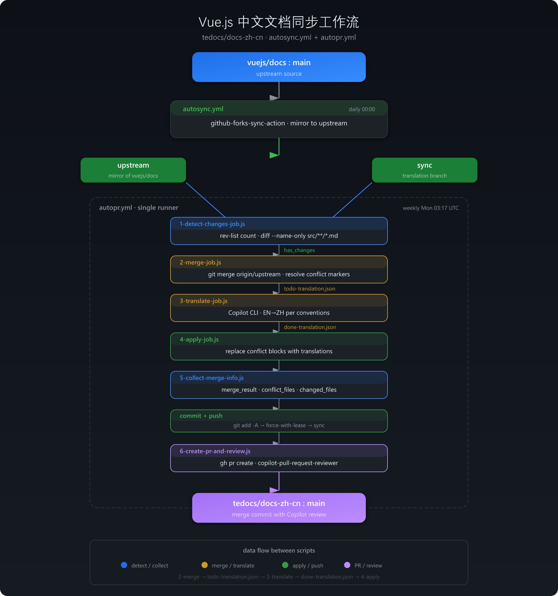
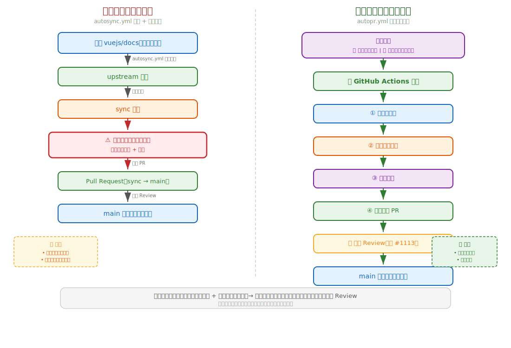
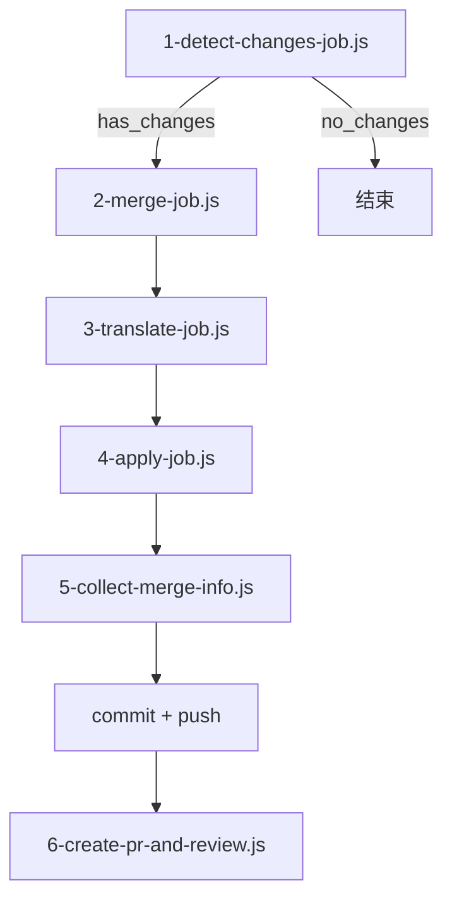

# Vue.js 中文文档自动同步 PR 工作流

本文档介绍 `tedocs/docs-zh-cn` 仓库的自动化同步流程，包括上游同步、冲突检测、Copilot CLI 翻译、PR 和 Review。

## 流程总览

## 本流程是做什么的？

当前同步上游仓库 `vuejs/docs`，是基于自动 `autosync.yml` 的 workflow 同步英文仓库到 `upstream` 分支，然后将 `upstream` 合并到 `sync` 分支，在 `sync` 分支解决合并的冲突、翻译后，将 `sync` 分支通过 PR 合并到 `main` 分支。

此时，社区可以在 PR 中 review，比如：[Sync #31b4521a](https://github.com/vuejs-translations/docs-zh-cn/pull/1113)，在将 `upstream` 合并到 `sync` 分支和冲突过程，往往需要维护者耗费大量的时间精力成本在本地分支解决。

为此，`autopr.yml` 提出的方案是，基于 Github Actions 自动来处理这个过程，并实现：分支预处理——>解决冲突——>翻译——>发起 PR，可以设置为每周执行一次，或者维护者手动在 Github Actions 手动触发 `autopr.yml`，仅需点一下，自动完成整个流程。

### 分支说明

| 分支       | 用途                                                    |
|------------|---------------------------------------------------------|
| `main`     | 主分支，用于发布和日常开发                               |
| `upstream` | 上游 `vuejs/docs:main` 的镜像，每日自动同步              |
| `sync`     | 翻译工作分支，合并上游变更后翻译，最终通过 PR 合并到 main |

## 如何使用 `autopr.yam`

### 第一步：自动同步上游 (autosync.yml)

**触发方式：**每日 00:00 自动执行 / 手动触发

**流程：**

1. 使用 `github-forks-sync-action` 拉取 `vuejs/docs:main` 的最新内容
2. 推送到 `vuejs-translations/docs-zh-cn:upstream` 分支
3. 纯镜像同步，不做任何翻译

### 第二步：检测、合并、翻译、提交、发 PR (autopr.yml)

**触发方式：**每周一 03:17 UTC 自动执行 / 手动触发

单 runner 串行执行 6 个 JS 脚本：

#### 1-detect-changes-job.js — 前置过滤

- `git rev-list --count origin/sync..origin/upstream` 判断有无新提交
- `git diff --name-only` 检出变更的 `.md` 文件列表
- 输出 `upstream_hash`、`changed_files`
- 无变更时输出 `merge_result=no_changes`，整个流程终止

#### 2-merge-job.js — 冲突解决

- `git merge origin/upstream` 触发合并
- 解析冲突标记，按策略处理：
  - `pnpm-lock.yaml` → 整文件接受 incoming
  - `package.json`、`*.vue`、`*.ts`、`*.json` → 解析标记，只替换冲突块
  - `.md` 文件 → 逐块解析，记录 ours/theirs 到 `todo-translation.json`
- 解决后 `git add` 暂存

#### 3-translate-job.js — Copilot CLI 翻译

- 读取 `todo-translation.json`
- 加载翻译约定 (terminology.md、formatting.md、guidelines.md)
- 对每个冲突块调用 `copilot -p "..." --allow-all` 翻译 EN→ZH
- 输出 `done-translation.json`

#### 4-apply-job.js — 应用翻译

- 读取 `done-translation.json`
- 按文件分组，按行号倒序替换，避免索引偏移

#### 5-collect-merge-info.js — 收集真实结果

- 读取 `todo-translation.json` 提取实际冲突文件列表
- `git diff HEAD` 收集实际变更文件
- 输出 `merge_result` (conflict/clean)、`conflict_files`、`changed_files`

#### 6-create-pr-and-review.js — 发起 PR + Review

- `gh pr list` 检查是否已有 open PR
- `gh pr create` 创建 PR (含 body、labels)
- GitHub API 请求 `copilot-pull-request-reviewer[bot]` review
- 发表评论要求检查：翻译准确性、无意外变更、markdown 格式完整性

## Secrets 配置

| Secret 名称            | 用途                                                          |
|------------------------|---------------------------------------------------------------|
| `REPO_ACTION_TOKEN`    | Classic PAT，用于 checkout、push、创建 PR/Issue、请求 review      |
| `COPILOT_GITHUB_TOKEN` | Fine-Grained PAT，Copilot CLI 认证（需 "Copilot Requests" 权限） |

## 翻译约定

- [主约定](../../../.claude/skills/vuejs-docs-zh-cn/SKILL.md)
- [术语翻译约定](../../../.claude/skills/vuejs-docs-zh-cn/references/terminology.md)
- [文本格式](../../../.claude/skills/vuejs-docs-zh-cn/references/formatting.md)
- [翻译指南](../../../.claude/skills/vuejs-docs-zh-cn/references/guidelines.md)

## 特殊说明

### 翻译策略

#### `all` 模式

在 [3-translate-job.js](3-translate-job.js) 中使用了 `MODE=all` 的方式来批量处理 `todo-translation.json`，以追求效率，测试 42 个 item 仅需 3 分钟左右，在目前 vuejs 文档区域平稳当下，比较适合，预期不会有大量的变更出现。

当然，如果出现大量变更的情况，可能导致 `dodo-translation.json` 很大 Copilot CLI 处理失败，这时候，可能需要分割 `todo-translation.json` 的大小来解决。

#### `file` 模式

基于 `todo-translation.json` 每一项来单个处理，这意味着，数组的每一项都要完整走遍 Copilot CLI 的任务处理。

`file` 模式在处理大型变更时候，可能会恰当，当然，需要减少 `todo-translation.json` 的数组长度，以节省成本。

### sync 分支仍需手动处理

- [ ] 后续考虑采用 ci 的方式来完成，预计 `sync->main` 仍需认为处理

## 特别感谢

在 `vuejs-translations/docs-zh-cn` 项目中，Github Copilot 额度由 [@Justineo](https://github.com/Justineo) 友情赞助。
