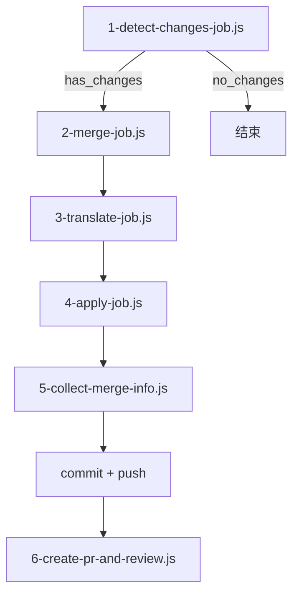

# Vue.js 中文文档自动同步 PR 工作流

本文档介绍 `tedocs/docs-zh-cn` 仓库的自动化同步流程，包括上游同步、冲突检测、Copilot CLI 翻译、PR 和 Review。

## 流程总览


## 分支说明

| 分支 | 用途 |
|------|------|
| `main` | 主分支，用于发布和日常开发 |
| `upstream` | 上游 `vuejs/docs:main` 的镜像，每日自动同步 |
| `sync` | 翻译工作分支，合并上游变更后翻译，最终通过 PR 合并到 main |

## 第一步：自动同步上游 (autosync.yml)

**触发方式：**每日 00:00 自动执行 / 手动触发

**流程：**

1. 使用 `github-forks-sync-action` 拉取 `vuejs/docs:main` 的最新内容
2. 推送到 `tedocs/docs-zh-cn:upstream` 分支
3. 纯镜像同步，不做任何翻译


## 第二步：检测、合并、翻译、提交、发 PR (autopr.yml)

**触发方式：**每周一 03:17 UTC 自动执行 / 手动触发

单 runner 串行执行 6 个 JS 脚本：



### 1-detect-changes-job.js — 前置过滤

- `git rev-list --count origin/sync..origin/upstream` 判断有无新提交
- `git diff --name-only` 检出变更的 `.md` 文件列表
- 输出 `upstream_hash`、`changed_files`
- 无变更时输出 `merge_result=no_changes`，整个流程终止

### 2-merge-job.js — 冲突解决

- `git merge origin/upstream` 触发合并
- 解析冲突标记，按策略处理：
  - `pnpm-lock.yaml` → 整文件接受 incoming
  - `package.json`、`*.vue`、`*.ts`、`*.json` → 解析标记，只替换冲突块
  - `.md` 文件 → 逐块解析，记录 ours/theirs 到 `todo-translation.json`
- 解决后 `git add` 暂存

### 3-translate-job.js — Copilot CLI 翻译

- 读取 `todo-translation.json`
- 加载翻译约定 (terminology.md、formatting.md、guidelines.md)
- 对每个冲突块调用 `copilot -p "..." --allow-all` 翻译 EN→ZH
- 输出 `done-translation.json`

### 4-apply-job.js — 应用翻译

- 读取 `done-translation.json`
- 按文件分组，按行号倒序替换，避免索引偏移

### 5-collect-merge-info.js — 收集真实结果

- 读取 `todo-translation.json` 提取实际冲突文件列表
- `git diff HEAD` 收集实际变更文件
- 输出 `merge_result` (conflict/clean)、`conflict_files`、`changed_files`

### 6-create-pr-and-review.js — 发起 PR + Review

- `gh pr list` 检查是否已有 open PR
- `gh pr create` 创建 PR (含 body、labels)
- GitHub API 请求 `copilot-pull-request-reviewer[bot]` review
- 发表评论要求检查：翻译准确性、无意外变更、markdown 格式完整性

## 手动操作

```bash
# 触发 autosync
gh workflow run autosync.yml

# 触发 auto-pr
gh workflow run autopr.yml
```

## Secrets 配置

| Secret 名称 | 用途 |
|-------------|------|
| `REPO_ACTION_TOKEN` | Classic PAT，用于 checkout、push、创建 PR/Issue、请求 review |
| `COPILOT_GITHUB_TOKEN` | Fine-Grained PAT，Copilot CLI 认证（需 "Copilot Requests" 权限） |

## 翻译约定

- [主约定](../../../.claude/skills/vuejs-docs-zh-cn/SKILL.md)
- [术语翻译约定](../../../.claude/skills/vuejs-docs-zh-cn/references/terminology.md)
- [文本格式](../../../.claude/skills/vuejs-docs-zh-cn/references/formatting.md)
- [翻译指南](../../../.claude/skills/vuejs-docs-zh-cn/references/guidelines.md)
