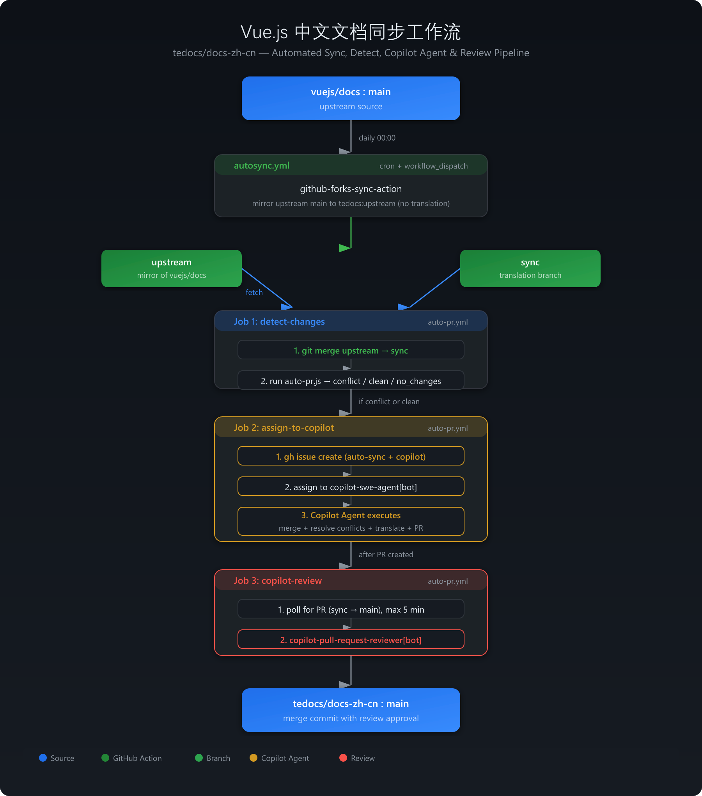
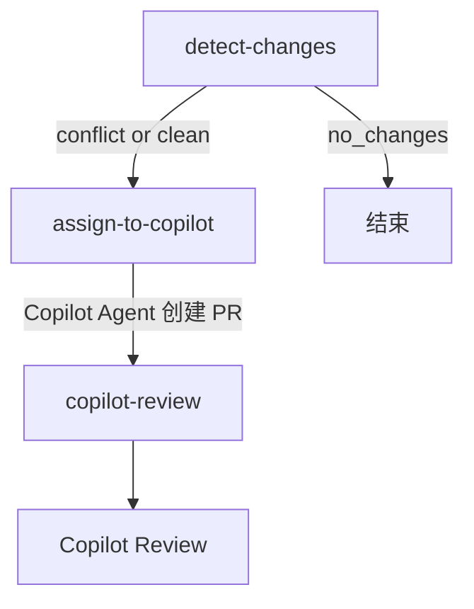

# Vue.js 中文文档同步工作流

本文档介绍 `tedocs/docs-zh-cn` 仓库的自动化同步流程，包括上游同步、冲突检测、Copilot agent 翻译、PR 和 Review。

## 先决条件

- 开 issue 功能
- 创建 `auto-sync`、`copilot` label

## 流程总览



## 分支说明

| 分支 | 用途 |
|------|------|
| `main` | 主分支，用于发布和日常开发 |
| `upstream` | 上游 `vuejs/docs:main` 的镜像，每日自动同步 |
| `sync` | 翻译工作分支，合并上游变更后翻译，最终通过 PR 合并到 main |

## 第一步：自动同步上游（autosync.yml）

**触发方式：** 每日 00:00 自动执行 / 手动触发

**流程：**

1. 使用 `github-forks-sync-action` 拉取 `vuejs/docs:main` 的最新内容
2. 推送到 `tedocs/docs-zh-cn:upstream` 分支
3. 纯镜像同步，不做任何翻译


## 第二步：检测变更、分配 Copilot、自动 Review（autopr.yml）

**触发方式：** 每周一 03:17 UTC 自动执行 / 手动触发

### Job 1: detect-changes

Checkout `sync` 分支，运行 `scripts/merge-upstream-to-sync.js` 检测合并状态：

1. 尝试将 `upstream` 合并到 `sync`
2. 脚本检测合并结果并输出：
   - `merge_result=conflict` — 有冲突，列出冲突文件
   - `merge_result=clean` — 无冲突，列出变更的 `.md` 文件
   - `merge_result=no_changes` — 无变更（整个流程终止）

### Job 2: assign-to-copilot

当有变更或冲突时（`merge_result != no_changes`），创建 GitHub Issue 并分配给 Copilot coding agent：

- Issue 包含冲突文件列表、变更文件列表、上游 hash
- 引用翻译约定文件（SKILL.md + terminology.md + formatting.md + guidelines.md）
- 指导 Copilot agent 执行：合并、冲突解决、翻译、创建 PR
- 标签：`auto-sync`、`copilot`
- Assignee：`copilot-swe-agent[bot]`

### Job 3: copilot-review

等待 Copilot agent 创建 PR 后，自动请求 GitHub Copilot review：

- 轮询等待 PR（sync → main）出现，最长 5 分钟
- 请求 `copilot-pull-request-reviewer[bot]` 进行 review
- 发表评论要求检查：翻译准确性、无意外变更、markdown 格式完整性、代码块和链接完整性



## 手动操作

### 手动触发同步

```bash
# 触发 autosync
gh workflow run autosync.yml

# 触发 auto-pr
gh workflow run autopr.yml
```

### 本地运行脚本

```bash
# 安装依赖
pnpm install

# 运行检测脚本
pnpm auto-pr

# 查看上游 diff
pnpm sync compare

# 生成 PR 标题和内容
pnpm sync pr
```

## Secrets 配置

| Secret 名称 | 用途 |
|-------------|------|
| `REPO_ACTION_TOKEN` | GitHub PAT，用于推送代码、创建 PR/Issue、请求 review |

PAT 所需权限：

- `Contents: Read and write`
- `Pull requests: Read and write`
- `Issues: Read and write`

## 翻译约定

翻译遵循以下约定文件：

- [主约定](../.claude/skills/vuejs-docs-zh-cn/SKILL.md)
- [术语翻译约定](../.claude/skills/vuejs-docs-zh-cn/references/terminology.md)
- [文本格式](../.claude/skills/vuejs-docs-zh-cn/references/formatting.md)
- [翻译指南](../.claude/skills/vuejs-docs-zh-cn/references/guidelines.md)
